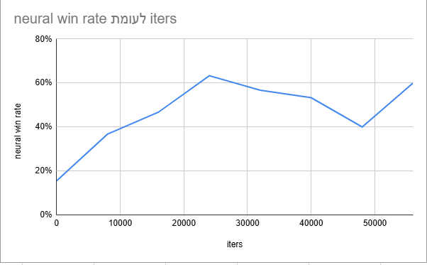

# Backgammon AI

A Python implementation of Backgammon with a Tkinter GUI and five AI opponents ranging from a random mover to a trained PyTorch neural network. A built-in tournament mode lets any combination of bots compete round-robin, with per-bot parameter tuning done through a setup screen — no code editing required.

---

## Author

**Yarin Solomon** — Full Stack Developer

- Email: [yarinso39@gmail.com](mailto:yarinso39@gmail.com)
- GitHub: [github.com/yarins0](https://github.com/yarins0)
- LinkedIn: [linkedin.com/in/yarin-solomon](https://www.linkedin.com/in/yarin-solomon/)
- Portfolio: [https://yarin-lab.vercel.app/](https://yarin-lab.vercel.app/)
---

## Features

- **Tournament setup UI** — pick any combination of bots, tune each one's parameters via sliders and spinboxes, then hit Start. No code changes needed.
- **Five AI strategies** — Random, Heuristic, Minimax, MCTS, and Neural Network, all configurable at runtime.
- **Human play** — play against any AI or watch AIs compete.
- **Board history navigation** — step backward and forward through move history during a game.
- **Round-robin tournament** — when more than two players are added, the game manager runs every matchup and reports a final winner.
- **Turn indicator** — a color-coded label below the board shows whose turn it is at a glance.
- **Matchup display** — a headline above the board shows who is playing (e.g. "Heuristic Player (black) vs Human Player (white)").
- **Move enforcement** — the End Turn button is blocked if you still have legal moves available.

---

## AI Strategies

### Random
Makes a uniformly random legal move. Useful as a baseline opponent.

### Heuristic
Evaluates board positions using a weighted sum of six features:

| Feature | Description |
|---|---|
| `prime_structure` | Consecutive occupied points blocking the opponent |
| `anchors` | Defensive anchor points in the opponent's home board |
| `blots` | Penalty for exposed single checkers |
| `race_advantage` | Overall checker progress toward the home board |
| `home_board_strength` | Strength of the home board for blocking re-entry |
| `captured_pieces` | Value of hitting and holding opponent pieces |

All six weights are adjustable in the tournament setup screen.

### Minimax
Depth-limited minimax search using the heuristic evaluator above. Depth and all six weights are configurable. No alpha-beta pruning in the current implementation.

### MCTS (Monte Carlo Tree Search)
Explores the move tree using UCB1 selection, balancing exploration and exploitation. The exploration constant `c` and all six heuristic weights are configurable.

### Neural Network
A PyTorch feed-forward network trained on board positions scored by the heuristic evaluator. Multiple trained model checkpoints are included in `HeuristicNets/` and selectable from the setup screen.

The chart below shows win rate against the heuristic player across training iterations. The network starts near random (~18%) and converges to ~60%, demonstrating that it successfully learns to outperform the hand-tuned heuristic it was trained against.



---

## Project Structure

```
Backgammon_Mini/
├── run.py                    # Entry point — launches the tournament setup screen
├── TournamentSetup.py        # Tkinter tournament configuration UI
├── BackgammonGameManager.py  # Game loop, turn management, round-robin logic
├── GUI.py                    # Board rendering and human input handling
├── Constants.py              # All tunable flags and default values
├── Eval_position.py          # Heuristic board evaluation functions
├── BoardTree.py              # Game tree structure for Minimax and MCTS
├── HeuristicNet.py           # Neural network definition and training utilities
├── HeuristicNets/            # Saved model checkpoints (.pth files)
├── Players/
│   ├── Player.py             # Base class (includes move generation)
│   ├── Human_Player.py
│   ├── AI_Player.py          # Base class for all AI players
│   ├── Random_Player.py
│   ├── Heuristic_Player.py
│   ├── Min_Max_Player.py
│   ├── MCTS_Player.py
│   └── Neural_Player.py
├── analysis/                 # Research scripts and results
│   ├── benchmark_heuristic_vs_neural.py
│   ├── random_ratio_tournament.py
│   └── neural_winrate_vs_training_iters.png
└── tests/
    └── test_core.py          # Unit tests (run with: python -m pytest tests/)
```

---

## Installation

### Requirements

- Python 3.8+
- PyTorch (`pip install torch`)
- Tkinter (included with standard Python on Windows and macOS; on Linux: `sudo apt install python3-tk`)
- pytest (`pip install pytest`) — for running the test suite

### Steps

```sh
git clone https://github.com/yarins0/Backgammon_Mini.git
cd Backgammon_Mini
pip install torch
python run.py
```

### Running Tests

```sh
pip install pytest
python -m pytest tests/
```

---

## Usage

### Tournament Setup Screen

When you launch `run.py`, the setup screen opens. From there:

1. Select a player type from the dropdown.
2. Adjust the parameters that appear (heuristic weights, depth, exploration constant, or model file).
3. Click **Add Player**. Repeat for each participant (minimum 2).
4. Click **Start Tournament**.

The game runs all matchups in round-robin order and displays the final winner when done.

### Constants.py flags

| Flag | Default | Description |
|---|---|---|
| `GUI_MODE` | `True` | Set to `False` to run headless (useful for bulk training) |
| `ONE_RUN` | `False` | Set to `True` to stop after one game instead of looping |
| `NETWORK_TRAINING` | `False` | Set to `True` to train the neural network on completed games |
| `DEBUG_MODE` | `False` | Set to `True` to print board state and move info to console |

---

## Distribution (Windows .exe)

Use PyInstaller to package the project as a standalone executable:

```sh
pip install pyinstaller
pyinstaller run.py --name BackgammonAI --windowed --collect-all torch --hidden-import=torch --add-data "HeuristicNets/*.pth;HeuristicNets/"
```

The output is in `dist/BackgammonAI/`. Zip that folder to distribute.

---

## Game Rules

Backgammon is a two-player game played on a 24-point board. Each player moves their 15 checkers in opposite directions according to two dice rolls, aiming to bear off all checkers first.

- A point with a single checker (a *blot*) can be hit by the opponent and sent to the bar.
- A player with checkers on the bar must re-enter them before making any other move.
- Once all checkers are in the home board, a player may begin bearing off.
- The first player to bear off all 15 checkers wins.

For full rules see the [official backgammon rules](https://usbgf.org/backgammon-basics-how-to-play/).
