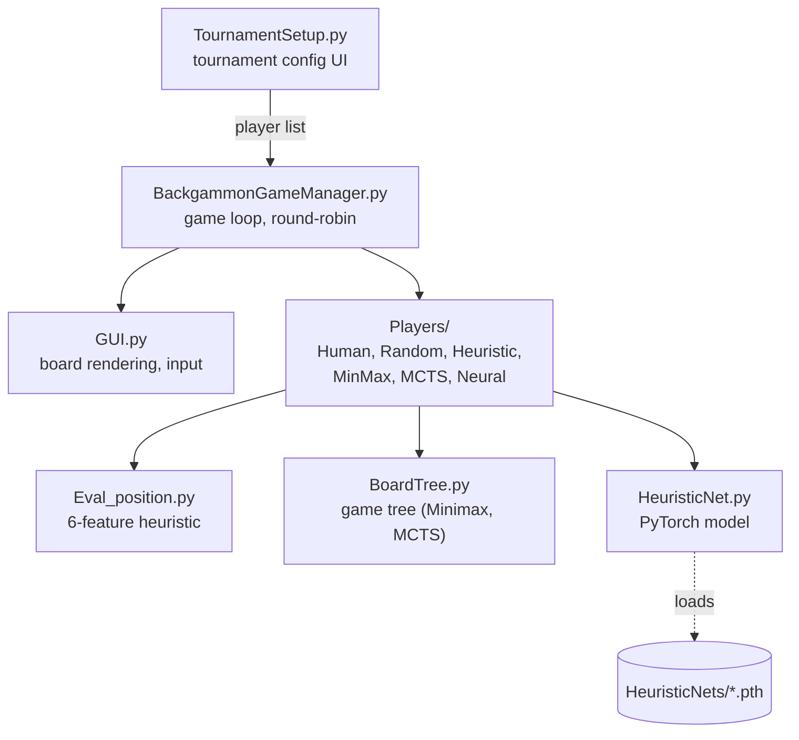
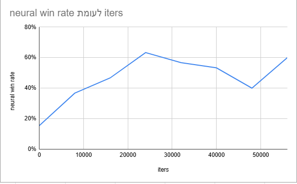
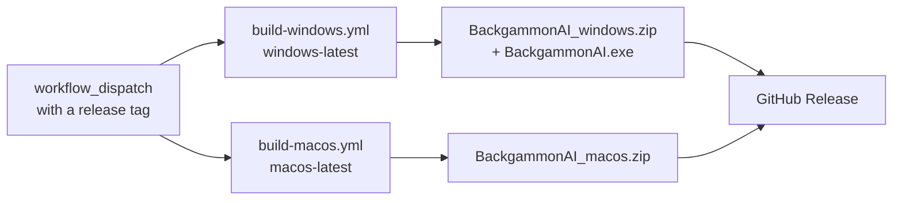

# 🎲 Backgammon AI

[](.github/workflows/build-windows.yml)
[](HeuristicNet.py)
[](GUI.py)
[](packaging)
[](tests/test_core.py)

A Python implementation of Backgammon with a Tkinter GUI and five AI opponents ranging from a random mover to a trained PyTorch neural network.

A built-in tournament mode lets any combination of bots — or a human — compete round-robin, with every parameter tuned through a setup screen rather than by editing source. The engineering worth reading is in `Eval_position.py`, `BoardTree.py`, and `HeuristicNet.py`: the same six-feature heuristic evaluator backs the Heuristic, Minimax, and MCTS players, and the neural player is trained to outperform it.


**Live demo:** [yarin-lab.vercel.app/backgammon](https://yarin-lab.vercel.app/backgammon)

**Author:** Yarin Solomon · [github.com/yarins0](https://github.com/yarins0) · [linkedin.com/in/yarin-solomon](https://www.linkedin.com/in/yarin-solomon/) · [yarinso39@gmail.com](mailto:yarinso39@gmail.com)

## 📑 Table of Contents

- [🏗️ Architecture](#-architecture)
- [🤖 AI Strategies](#-ai-strategies)
- [💻 Local Development](#-local-development)
- [⚙️ Configuration](#-configuration)
- [📦 Distribution](#-distribution)
- [📁 Repo Layout](#-repo-layout)
- [🎯 Game Rules](#-game-rules)
- [👤 Author](#-author)

## 🏗️ Architecture


```mermaid
flowchart TB
    Setup["TournamentSetup.py<br/>tournament config UI"] -->|"player list"| Manager["BackgammonGameManager.py<br/>game loop, round-robin"]
    Manager --> GUI["GUI.py<br/>board rendering, input"]
    Manager --> Players["Players/<br/>Human, Random, Heuristic,<br/>MinMax, MCTS, Neural"]
    Players --> Eval["Eval_position.py<br/>6-feature heuristic"]
    Players --> Tree["BoardTree.py<br/>game tree (Minimax, MCTS)"]
    Players --> Net["HeuristicNet.py<br/>PyTorch model"]
    Net -.->|"loads"| Checkpoints[("HeuristicNets/*.pth")]
```

- **`TournamentSetup.py`** — the entry screen. Add two or more players (any mix of bots and humans), tune each bot's parameters with sliders, then start.
- **`BackgammonGameManager.py`** — owns the board, initializes the current pair of players, and runs every matchup round-robin when more than two players are entered.
- **`GUI.py`** — Tkinter board rendering and human move input. Only loaded when `GUI_MODE` is `True` in `Constants.py`.
- **`Players/`** — one class per strategy, all sharing the `AI_Player` base. `Heuristic_Player`, `Min_Max_Player`, and `MCTS_Player` all call into `Eval_position.py`; `Neural_Player` loads a `.pth` checkpoint instead.
- **`Eval_position.py`** — scores a board as a weighted sum of six features (prime structure, anchors, blots, race advantage, home board strength, captured pieces). The weights are the tunable surface exposed in the setup screen.
- **`BoardTree.py`** — the game-tree node used by Minimax (depth-limited, no alpha-beta pruning) and MCTS (UCB1 selection).
- **`HeuristicNet.py`** — the PyTorch feed-forward network and its training loop. It is trained against positions scored by `Eval_position.py`, so its win rate is measured against the same heuristic it learns from.

The neural player's win rate against the heuristic player climbs from near-random (~18%) to ~60% over training iterations:



## 🤖 AI Strategies

| Strategy | File | Configurable at runtime |
|---|---|---|
| Random | `Players/Random_Player.py` | — |
| Heuristic | `Players/Heuristic_Player.py` | 6 evaluation weights |
| Minimax | `Players/Min_Max_Player.py` | search depth, 6 evaluation weights |
| MCTS | `Players/MCTS_Player.py` | UCB1 exploration constant `c`, 6 evaluation weights |
| Neural Network | `Players/Neural_Player.py` | checkpoint file (`HeuristicNets/*.pth`) |
| Human | `Players/Human_Player.py` | — |

## 💻 Local Development

**Prerequisites**: Python 3.12 or 3.13, PyTorch, Tkinter (bundled with standard Python on Windows and macOS; on Linux install `python3-tk`).

1. Clone the repo and install PyTorch:
   ```sh
   git clone https://github.com/yarins0/Backgammon_Mini.git
   cd Backgammon_Mini
   pip install torch
   ```
2. Launch the tournament setup screen:
   ```sh
   python run.py
   ```
3. In the setup screen: pick a player type from the dropdown, adjust its parameters, click **Add Player**, and repeat for at least two participants. Click **Start Tournament** to run every matchup round-robin.

**Tests**: `python -m pytest tests/`

## ⚙️ Configuration

All tunable flags live in `Constants.py` and take effect on the next run — none are read from the environment.

| Flag | Default | Purpose |
|---|---|---|
| `GUI_MODE` | `True` | `False` skips the Tkinter GUI entirely — used for headless bulk training. |
| `ONE_RUN` | `False` | `True` stops after one game instead of looping into the next tournament round. |
| `NETWORK_TRAINING` | `False` | `True` trains the neural network on completed games as they finish. |
| `DEBUG_MODE` | `False` | `True` prints board state and move info to the console. |
| `SAFE_TEST` | `False` | `True` skips initializing pieces onto the start board, for testing AI logic in isolation. |

## 📦 Distribution

`packaging/` holds PyInstaller specs for each platform; run every command from the project root.


```mermaid
flowchart LR
    Push["workflow_dispatch<br/>with a release tag"] --> BuildWin["build-windows.yml<br/>windows-latest"]
    Push --> BuildMac["build-macos.yml<br/>macos-latest"]
    BuildWin --> ZipWin["BackgammonAI_windows.zip<br/>+ BackgammonAI.exe"]
    BuildMac --> ZipMac["BackgammonAI_macos.zip"]
    ZipWin --> Release["GitHub Release"]
    ZipMac --> Release
```

- **Windows — folder build** (`packaging/windows_folder.spec`, recommended): produces `dist/BackgammonAI/`. Zip the whole folder — users extract it and run `BackgammonAI.exe` from inside.
  ```sh
  pip install pyinstaller
  python -m PyInstaller packaging/windows_folder.spec
  ```
- **Windows — single-file build** (`packaging/windows_onefile.spec`): produces one portable `dist/BackgammonAI.exe`. First launch takes about 60 seconds while PyTorch extracts to a temp folder. Uses `packaging/hooks/rthook_dlldir.py` to fix the DLL search path.
  ```sh
  python -m PyInstaller packaging/windows_onefile.spec
  ```
- **macOS** (`packaging/macos.spec`): build via `.github/workflows/build-macos.yml` (**Actions → Build macOS App → Run workflow**, enter a release tag) — no Mac required. To build manually on a Mac:
  ```sh
  pip install pyinstaller torch
  python -m PyInstaller packaging/macos.spec
  zip -r BackgammonAI_macos.zip dist/BackgammonAI.app
  ```

Both workflows are `workflow_dispatch`-triggered and upload the built zip straight to the GitHub Release matching the tag you enter.

## 📁 Repo Layout

```
run.py                    # Entry point — launches the tournament setup screen
TournamentSetup.py        # Tkinter tournament configuration UI
BackgammonGameManager.py  # Game loop, turn management, round-robin logic
GUI.py                    # Board rendering and human input handling
Constants.py              # All tunable flags and default values
Eval_position.py          # Heuristic board evaluation functions
BoardTree.py              # Game tree structure for Minimax and MCTS
HeuristicNet.py           # Neural network definition and training utilities
HeuristicNets/            # Saved model checkpoints (.pth files)
Players/                  # One class per strategy, sharing the AI_Player / Player base
packaging/                # PyInstaller specs and hooks for Windows and macOS builds
.github/workflows/        # workflow_dispatch builds that publish zips to a GitHub Release
analysis/                 # Training charts and evaluation scripts
tests/                    # pytest suite (BoardTree, evaluation, Player)
```

## 🎯 Game Rules

Backgammon is a two-player game played on a 24-point board. Each player moves their 15 checkers in opposite directions according to two dice rolls, aiming to bear off all checkers first.

- A point with a single checker (a *blot*) can be hit by the opponent and sent to the bar.
- A player with checkers on the bar must re-enter them before making any other move.
- Once all checkers are in the home board, a player may begin bearing off.
- The first player to bear off all 15 checkers wins.

For full rules see the [official backgammon rules](https://usbgf.org/backgammon-basics-how-to-play/).

## 👤 Author

**Yarin Solomon** — Full Stack Developer

- Email: [yarinso39@gmail.com](mailto:yarinso39@gmail.com)
- GitHub: [github.com/yarins0](https://github.com/yarins0)
- LinkedIn: [linkedin.com/in/yarin-solomon](https://www.linkedin.com/in/yarin-solomon/)
- Portfolio: [yarin-lab](https://yarin-lab.vercel.app/)
